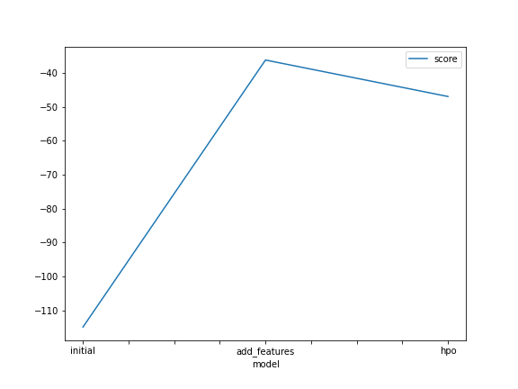
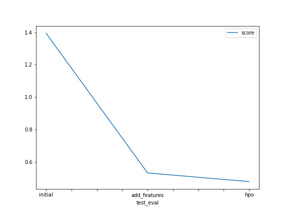

# Report: Predict Bike Sharing Demand with AutoGluon Solution
#### Hai Yan

## Initial Training
### What did you realize when you tried to submit your predictions? What changes were needed to the output of the predictor to submit your results?
There were negative predictions that will be rejected by Kaggle. So it's necessary to pin negative predictions to zero before submission.

### What was the top ranked model that performed?
It's a Weighted Ensemble Model. 

## Exploratory data analysis and feature creation
### What did the exploratory analysis find and how did you add additional features?
"Datetime" and "Season" have normal distribution, showing that the data was collected about uniformly across the year, which is good.
"temp" and "atemp" (feel-like temperatures) have strong positive correlation and having both features in the ML model doesn't add too much additional value.
"hour" feature (added later) have some obvious peaks in the distribution. It seems that during certain hours of day, we may see more bike rental, which is valuable info to our model.
So I added "hour" feature.

### How much better did your model preform after adding additional features and why do you think that is?
After adding the additional "hour" feature, the score on Kaggle improves from 1.39 to 0.53. I think that's because the added "hour" feature is a very importance feature in the ML model.

## Hyper parameter tuning
### How much better did your model preform after trying different hyper parameters?
The model score improves from 0.5329 to 0.4797

### If you were given more time with this dataset, where do you think you would spend more time?
I would spend more time on:
- optimizing features, for example, removing highly coupled features, keep one of "temp" and "atemp".
- do more hyper parameter tuning. I think there might still be potential gain in tuning hyper parameters, but there're so many things to tune and I need more time to investigate which is more important.

### Create a table with the models you ran, the hyperparameters modified, and the kaggle score.
|model|NN: dropout_prob|score|
|--|--|--|--|--|
|initial|0.1|1.39338|
|add_features|0.1|0.53293|
|hpo|2e-4|0|0.4797|

### Create a line plot showing the top model score for the three (or more) training runs during the project.

### Create a line plot showing the top kaggle score for the three (or more) prediction submissions during the project.

## Summary
In this project, I use a Auto ML tool - AutoGluon to solve a regression problem. In the process, I practice exploratory data analysis and 
improve model by adding key features and tuning hyper parameter.
Using AutoGluon simplifies the whole ML workflow and is a good way to get hands dirty on real-world problems. Yet to make the ML model work better, one still need insight into the domain to pick proper features and the algorithms to be able to tune hyper parameters.

